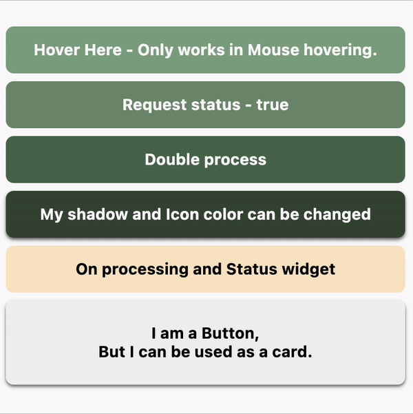
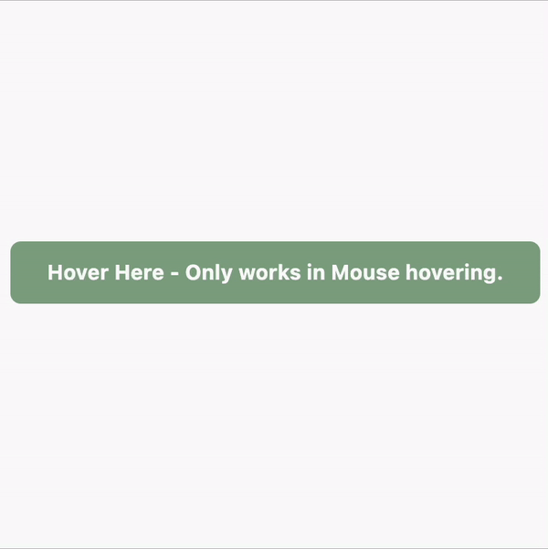
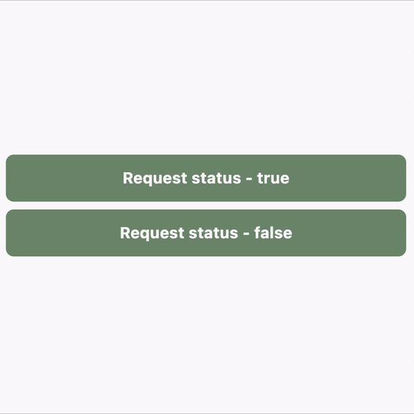
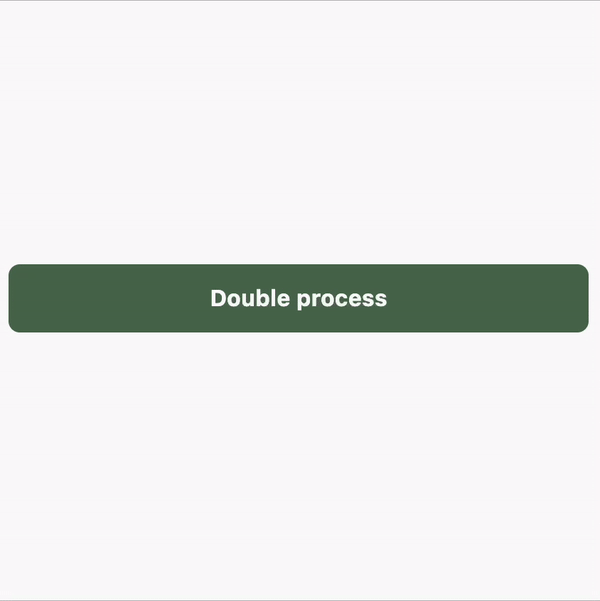
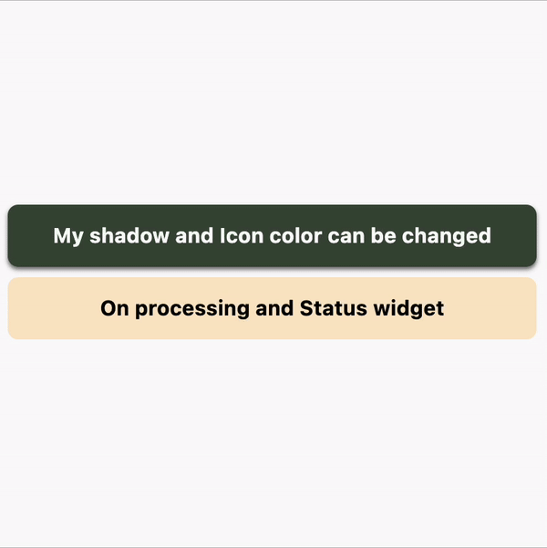
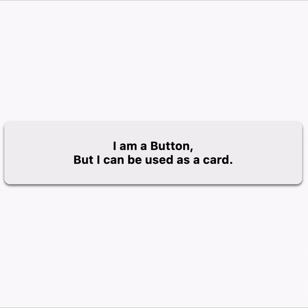

# ⚡ OnProcessButtonWidget

> A sleek, production-ready Flutter button widget with built-in loading states, progress indicators, and status feedback (Success/Error).


📦 **Ready for pub.dev!** A highly customizable replacement for standard buttons that handles asynchronous operations with ease.

---

## ✨ Features

- ⏳ **Loading State** — Built-in progress indicator, auto-disables button during execution.
- ✅ **Status Feedback** — Displays Success or Error icons/widgets based on operation result.
- 🎨 **Deeply Customizable** — Control colors, radius, borders, shadows, animations, and icons.
- 🔄 **Theme Support** — Global configuration via `OnProcessButtonTheme` or `OnProcessButtonDefaultValues`.
- 💫 **Smooth Animations** — Animated size transitions and status changes.
- 📱 **Platform Ready** — Supports Android, iOS, Web, macOS, Windows, and Linux.

---

## 📦 Installation

```bash
flutter pub add on_process_button_widget
```

Or add manually to `pubspec.yaml`:

```yaml
dependencies:
  on_process_button_widget: ^2.0.12
```

---

## 🚀 Quick Start

```dart
import 'package:on_process_button_widget/on_process_button_widget.dart';

// Basic usage — return true for success, false for error
OnProcessButtonWidget(
  onTap: () async {
    await Future.delayed(Duration(seconds: 2));
    return true; // Shows success icon
  },
  child: Text('Submit'),
)

// With full customization
OnProcessButtonWidget(
  backgroundColor: Colors.blue,
  iconColor: Colors.white,
  onTap: () async {
    bool success = await myAsyncOperation();
    return success;
  },
  onDone: (isSuccess) {
    print('Operation finished with success: $isSuccess');
  },
  child: Text('Save Changes'),
)
```

---

## 🎛️ Key Properties

| Property | Type | Default | Description |
|----------|------|---------|-------------|
| `onTap` | `Future<bool?> Function()?` | `null` | Async tap handler. Return `true` for success, `false` for error. |
| `onDone` | `Function(bool?)?` | `null` | Called after `onTap` and status display completion. |
| `child` | `Widget?` | `null` | Primary button content. |
| `isRunning` | `bool` | `false` | Manually trigger loading state. |
| `backgroundColor` | `Color?` | `Theme primary` | Button background color. |
| `borderRadius` | `BorderRadius?` | `8.0` | Corner radius. |
| `onRunningWidget` | `Widget?` | `CircularProgress` | Widget shown while processing. |
| `onSuccessWidget` | `Widget?` | `Icons.done` | Widget shown on success. |
| `onErrorWidget` | `Widget?` | `Icons.error` | Widget shown on error. |
| `expanded` | `bool` | `true` | Whether to take full available width. |

---

## 🎨 Global Configuration

You can set default values for all buttons in your app using `OnProcessButtonDefaultValues` or `OnProcessButtonThemeProvider`.

```dart
void main() {
  // Simple property defaults
  OnProcessButtonDefaultValues.backgroundColor = Colors.deepPurple;
  OnProcessButtonDefaultValues.borderRadius = BorderRadius.circular(12);
  OnProcessButtonDefaultValues.expandedIcon = true;
  OnProcessButtonDefaultValues.roundBorderWhenRunning = false;

  // Global status change listener (e.g., showing a dialog during processing)
  OnProcessButtonDefaultValues.onStatusChange = (context, status) {
    if (context == null) return;

    if (status == OnProcessButtonStatus.running) {
      showDialog(
        context: context,
        barrierDismissible: false,
        builder: (context) => AlertDialog(
          title: Text("Processing"),
          content: Text("Please wait while we handle your request..."),
        ),
      );
    } else if (status == OnProcessButtonStatus.stable) {
      // Auto-close dialog when finished
      Navigator.of(context).pop();
    }
  };

  runApp(MyApp());
}
```


---

## 📸 Screenshots & Demos

| All Features | Hover Effects |
|:---:|:---:|
|  |  |
| **Request Status** | **Double Process** |
|  |  |
| **Custom Styles** | **Card Mode** |
|  |  |

---

## 📄 License

This project is licensed under the BSD 3-Clause License - see the [LICENSE](LICENSE) file for details.

---

<p align="center">
  Made with ❤️ by <a href="https://github.com/SHAJED99">Shajedur Rahman Panna</a>
</p>
