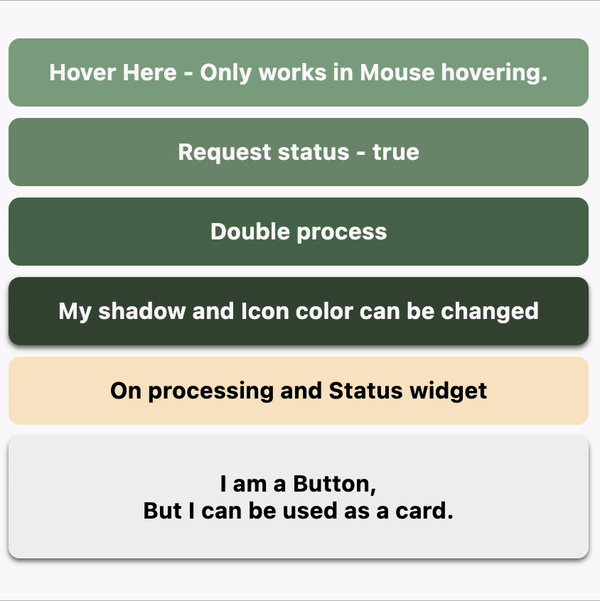
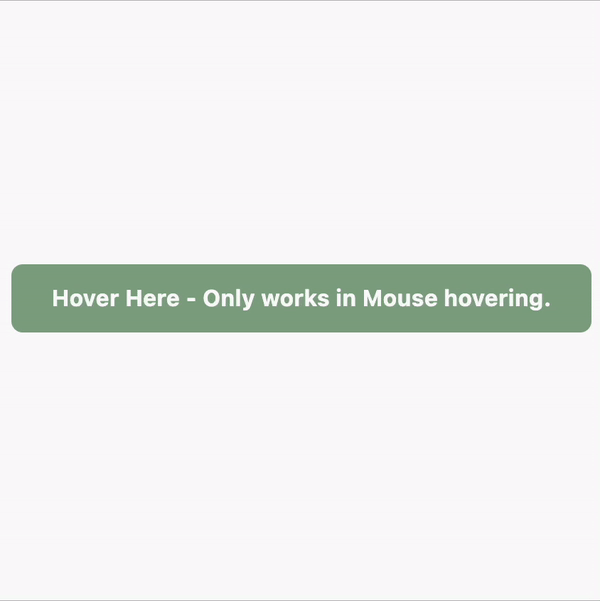
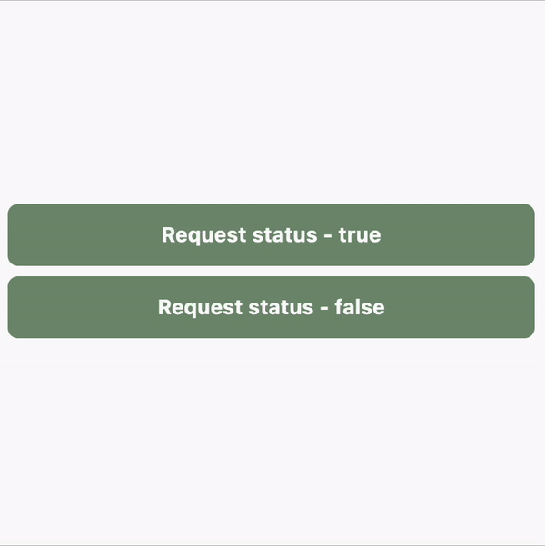
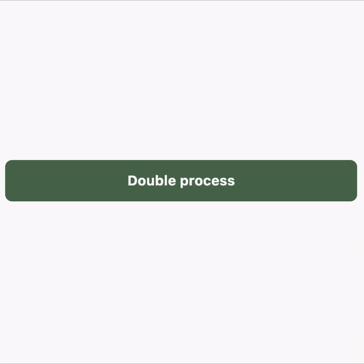
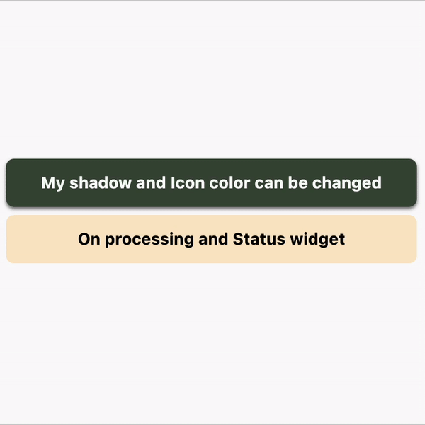
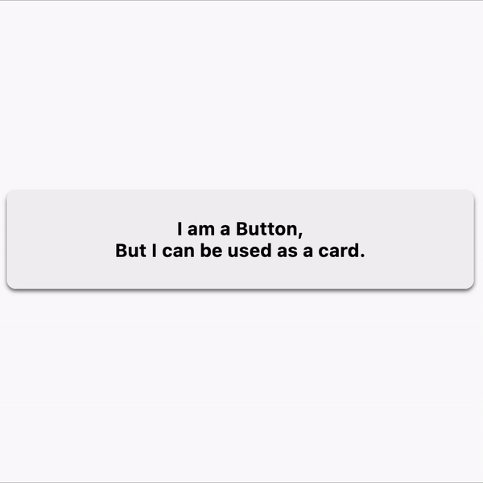

# ⚡ OnProcessButtonWidget

A production-ready Flutter button widget with built-in loading animations and status feedback (Success/Error). Perfect for asynchronous operations and form submissions.

[](https://flutter.dev)
[](https://dart.dev)
[](LICENSE)
[](https://pub.dev/packages/on_process_button_widget)

---

## ✨ Features

- ⏳ **Loading State** — Built-in progress indicator; button auto-disables during execution.
- ✅ **Status Feedback** — Success/Error icons shown based on operation result.
- 🎨 **Deeply Customizable** — Colors, radius, borders, shadows, animations, icons, and more.
- 🔄 **Theme Support** — Global defaults via `OnProcessButtonDefaultValues` or `OnProcessButtonTheme`.
- 💫 **Smooth Animations** — Animated size transitions between states.
- 📱 **Platform Ready** — Android, iOS, Web, macOS, Windows, and Linux.

---

## 📦 Installation

```bash
flutter pub add on_process_button_widget
```

Or add to `pubspec.yaml`:

```yaml
dependencies:
  on_process_button_widget: ^2.1.0
```

```dart
import 'package:on_process_button_widget/on_process_button_widget.dart';
```

---

## 🚀 Usage

### Basic Button

`onTap` runs your async operation. Everything the button does follows from what you return:

| You return | What the user sees | When `onDone` fires |
|---|---|---|
| `true` | Success icon (`Icons.done`) for `statusShowingDuration` | after that delay, with `true` |
| `false` | Error icon (`Icons.error`) for `statusShowingDuration` | after that delay, with `false` |
| `null` | Nothing — straight back to idle | immediately, with `null` |
| *(it throws)* | Nothing — straight back to idle | immediately, with `null` |

```dart
OnProcessButtonWidget(
  onTap: () async {
    await submitForm();
    return true;
  },
  child: const Text('Submit'),
)
```

**Handle your own errors inside `onTap`.** If `onTap` throws, the button recovers correctly, but the error is then rethrown so it isn't silently swallowed — meaning it surfaces as an uncaught async error in your app (and will fail your widget tests). If a failure should show the error icon rather than blow up, catch it and return `false`:

```dart
onTap: () async {
  try {
    await api.submitForm(data);
    return true;
  } catch (e) {
    logger.warning('submit failed', e);
    return false; // shows the error icon
  }
},
```

Return `null` when you want no status feedback at all — a refresh button, or a tap that navigates away.

### Filled Button (Default)

Uses `Theme.of(context).colorScheme.primary` as background and `onPrimary` for text/icons automatically. No manual color styling needed on `Text()` or `Icon()` children — the button controls all color.

```dart
OnProcessButtonWidget(
  onTap: () async {
    await Future.delayed(const Duration(seconds: 2));
    return true;
  },
  child: const Row(
    mainAxisSize: MainAxisSize.min,
    children: [
      Icon(Icons.download),
      SizedBox(width: 8),
      Text('Download'),
    ],
  ),
)
```

### Outlined Button

```dart
OnProcessButtonWidget(
  expanded: false,
  border: Border.all(color: Theme.of(context).colorScheme.outline),
  backgroundColor: Colors.transparent,
  iconColor: Theme.of(context).colorScheme.onSurface,
  fontColor: Theme.of(context).colorScheme.onSurface,
  fontWeight: FontWeight.normal,
  onTap: () async => true,
  child: const Row(
    mainAxisSize: MainAxisSize.min,
    children: [
      Icon(Icons.sync, size: 18),
      SizedBox(width: 8),
      Text('Refresh'),
    ],
  ),
)
```

### Colored Action Button (e.g. Danger)

```dart
OnProcessButtonWidget(
  expanded: false,
  border: Border.all(color: Colors.red),
  backgroundColor: Colors.red.withValues(alpha: 0.1),
  iconColor: Colors.red,
  fontColor: Colors.red,
  fontWeight: FontWeight.normal,
  onTap: () async {
    await performDangerousAction();
    return true;
  },
  child: const Row(
    mainAxisSize: MainAxisSize.min,
    children: [
      Icon(Icons.delete, size: 18),
      SizedBox(width: 8),
      Text('Delete'),
    ],
  ),
)
```

### Disabled Button

```dart
OnProcessButtonWidget(
  enable: false,
  onTap: () async => true,
  child: const Text('Disabled'),
)
```

### Manual Running State

Set `isRunning: true` to force the loading state without calling `onTap`. The callback won't be invoked.

```dart
OnProcessButtonWidget(
  isRunning: isLoading,
  child: const Text('Submit'),
)
```

### Color Rules Summary

| Style | `backgroundColor` | `border` | `iconColor` | `fontColor` |
|---|---|---|---|---|
| Filled (default) | (theme primary) | (none) | (theme onPrimary) | (theme onPrimary) |
| Outlined | `Colors.transparent` | `Border.all(...)` | `onSurface` | `onSurface` |
| Colored action | `color.withAlpha(25)` | `Border.all(color)` | same `color` | same `color` |

> **⚠️ Important**: Never set `color:` or `style:` directly on `Text()` or `Icon()` children. The button controls text/icon appearance via its own properties (`fontColor`, `iconColor`, `textStyle`, `fontWeight`). Manual colors will override the button's color system.

---

## 🎛️ Key Properties

| Property | Type | Default | Description |
|---|---|---|---|
| `onTap` | `Future<bool?> Function()?` | `null` | Async handler. Return `true`=success, `false`=error, `null`=skip status. |
| `onDone` | `void Function(bool?)?` | `null` | Called after tap completes and status finishes displaying. |
| `onStatusChange` | `void Function(BuildContext?, OnProcessButtonStatus)?` | `null` | Called when button status changes (stable/running/success/error). |
| `child` | `Widget?` | `null` | Primary button content (Text, Row with Icon+Text, etc.). |
| `expanded` | `bool` | `true` | Whether button fills available width. |
| `backgroundColor` | `Color?` | theme primary | Background color. |
| `iconColor` | `Color?` | theme onPrimary | Color of status indicators AND child icons. |
| `fontColor` | `Color?` | theme onPrimary | Color of button text. |
| `fontWeight` | `FontWeight?` | bold | Font weight. |
| `textStyle` | `TextStyle?` | titleMedium | Full text style override. |
| `border` | `BoxBorder?` | `null` | Border (set for outlined style). |
| `borderRadius` | `BorderRadius?` | 8.0 circular | Corner radius. |
| `boxShadow` | `List<BoxShadow>?` | `null` | Shadow under the button. |
| `contentPadding` | `EdgeInsetsGeometry?` | horiz:12, vert:4 | Inner padding. |
| `enable` | `bool?` | `true` | Whether button is interactive. |
| `onRunningWidget` | `Widget?` | `CircularProgressIndicator` | Shown during loading. |
| `onSuccessWidget` | `Widget?` | `Icons.done` | Shown on success. |
| `onErrorWidget` | `Widget?` | `Icons.error` | Shown on error. |
| `showRunningStatusWidget` | `bool?` | `true` | Whether to show the running status widget. |
| `roundBorderWhenRunning` | `bool?` | `true` | Circular border during non-stable states. |
| `expandedIcon` | `bool?` | `null` | Whether status icon fills available width. |
| `statusShowingDuration` | `Duration?` | 2 seconds | How long success/error is displayed. |
| `isRunning` | `bool` | `false` | Manually force running/loading state. |

For the complete property reference including interaction callbacks, mouse/focus/highlight, animation, and text styling, see the [API Reference](#-api-reference) section.

---

## 🎨 Styling with Properties

The button provides dedicated properties for all visual aspects. Do not style `Text()` or `Icon()` children directly.

```dart
OnProcessButtonWidget(
  backgroundColor: Colors.deepPurple,
  iconColor: Colors.white,
  fontColor: Colors.white,
  borderRadius: BorderRadius.circular(12),
  contentPadding: const EdgeInsets.symmetric(horizontal: 24, vertical: 12),
  onTap: () async => true,
  child: const Row(
    mainAxisSize: MainAxisSize.min,
    children: [
      Icon(Icons.save),
      SizedBox(width: 8),
      Text('Save Changes'),
    ],
  ),
)
```

---

## 🔄 Controller Pattern

Your controller methods should return `Future<bool?>`:

```dart
class AuthController {
  Future<bool?> login() async {
    try {
      await authService.login(email, password);
      return true;
    } catch (e) {
      return false;
    }
  }
}

// In your view:
OnProcessButtonWidget(
  onTap: controller.login,
  child: const Text('Login'),
)
```

---

## 🔀 Conditional Flow

Show a confirmation dialog before executing, or chain operations:

```dart
OnProcessButtonWidget(
  onTap: () async {
    final confirmed = await showDialog<bool>(
      context: context,
      builder: (ctx) => AlertDialog(
        title: const Text('Confirm'),
        content: const Text('Proceed with this action?'),
        actions: [
          TextButton(onPressed: () => Navigator.pop(ctx, false), child: const Text('Cancel')),
          TextButton(onPressed: () => Navigator.pop(ctx, true), child: const Text('OK')),
        ],
      ),
    );
    if (confirmed != true) return false;
    await controller.dangerousAction();
    return true;
  },
  onDone: (isSuccess) {
    if (isSuccess == true) {
      ScaffoldMessenger.of(context).showSnackBar(
        const SnackBar(content: Text('Action completed')),
      );
    }
  },
  child: const Text('Dangerous Action'),
)
```

---

## 🌐 Global Configuration

### OnProcessButtonDefaultValues

Set app-wide defaults before `runApp`. Properties are static and persist for the application lifetime.

```dart
void main() {
  OnProcessButtonDefaultValues.borderRadius = BorderRadius.circular(12);
  OnProcessButtonDefaultValues.expandedIcon = true;
  OnProcessButtonDefaultValues.roundBorderWhenRunning = false;

  OnProcessButtonDefaultValues.onStatusChange = (context, status) {
    if (context == null) return;
    if (status == OnProcessButtonStatus.running) {
      showDialog(
        context: context,
        barrierDismissible: false,
        builder: (_) => const AlertDialog(
          title: Text('Processing'),
          content: Text('Please wait...'),
        ),
      );
    } else if (status == OnProcessButtonStatus.stable) {
      Navigator.of(context).pop();
    }
  };

  runApp(const MyApp());
}
```

### OnProcessButtonTheme

Scoped defaults via inherited widget. Resolution order: `widget param → OnProcessButtonTheme.of(context) → OnProcessButtonDefaultValues → default`.

```dart
OnProcessButtonThemeProvider(
  data: const OnProcessButtonThemeData(
    borderRadius: BorderRadius.all(Radius.circular(16)),
    iconColor: Colors.white,
  ),
  child: MyWidget(),
)
```

> **⚠️ Don't put a `FocusNode` in the theme or the global defaults.** A `FocusNode` is stateful and must belong to a single widget; shared across buttons it misbehaves as soon as two are mounted. Pass `focusNode` per widget.

---

## ⚠️ Behavior Worth Knowing

| Behavior | What to expect |
|---|---|
| **Taps during a run are dropped** | While the button is running or showing a status, further taps are ignored. This is a built-in concurrency guard — you don't need your own "already submitting" flag. |
| **`onDone` is delayed** | On a `true`/`false` result it fires *after* `statusShowingDuration` (default **2s**), not when `onTap` resolves. Use it to chain follow-up work, not for anything latency-sensitive. |
| **`isRunning: true` doesn't call `onTap`** | It forces the loading visual only. Use it when something *else* drives the loading state. |
| **`enable: false` disables all press callbacks** | Since 2.1.0 this covers long-press, double-tap, tap up/down/cancel and secondary taps — not just `onTap`. Hover and focus callbacks still fire. It applies no "disabled" styling, so set your own colors if you want it to look disabled. |
| **`expanded` defaults to `true`** | The button fills the available width. Set `expanded: false` for an intrinsic-width button. |
| **`autofocus` defaults to `false`** | Changed in 2.1.0 — it used to be `true` and would steal focus from an autofocused `TextField`. Pass `autofocus: true` explicitly if you relied on the old behavior. |
| **`onStatusChange` may hand you a `null` context** | It fires on every transition, but passes `null` for the `BuildContext` if the widget is gone. Null-check before using it. |
| **`textStyle` is a full override** | If you pass it, `fontColor` and `fontWeight` no longer apply — fold the color into the `TextStyle`. |

---

## 🧪 Testing App Code That Uses This Button

The status delay is real time in tests, so a bare `pump()` won't reach the end state. Shorten the duration and settle:

```dart
await tester.pumpWidget(MaterialApp(
  home: Scaffold(
    body: OnProcessButtonWidget(
      statusShowingDuration: const Duration(milliseconds: 10),
      onTap: () async => true,
      child: const Text('Submit'),
    ),
  ),
));

await tester.tap(find.text('Submit'));
await tester.pump();                  // spinner is now showing
expect(find.byType(CircularProgressIndicator), findsOneWidget);
await tester.pumpAndSettle();         // runs through success → stable
```

If the code under test has an `onTap` that throws, the rethrown error reaches the zone and fails the test outright — `tester.takeException()` won't catch it, since that only surfaces errors reported through `FlutterError`. Wrap the interaction:

```dart
final caught = <Object>[];
await runZonedGuarded(() async {
  await tester.tap(find.text('Submit'));
  await tester.pump();
}, (Object error, StackTrace stack) => caught.add(error));
```

Better still, catch inside `onTap` and return `false` so this never comes up.

Note that `OnProcessButtonDefaultValues` is global with no `reset()` — anything a test sets leaks into later tests in the same run, so clear it in `tearDown`.

---

## 📸 Screenshots

| All Features | Hover Effects |
|:---:|:---:|
|  |  |
| **Request Status** | **Double Process** |
|  |  |
| **Custom Styles** | **Card Mode** |
|  |  |

---

## 📚 API Reference

### OnProcessButtonStatus `enum`

```dart
enum OnProcessButtonStatus { stable, running, success, error }
```

| Value | Meaning |
|---|---|
| `stable` | Idle state, showing `child`. |
| `running` | `onTap` is executing, showing `onRunningWidget`. |
| `success` | `onTap` returned `true`, showing `onSuccessWidget`. |
| `error` | `onTap` returned `false`, showing `onErrorWidget`. |

---

### OnProcessButtonWidget

The main button widget. A `StatefulWidget` with all properties passed via the constructor.

#### State Machine

```
stable → (tap) → running → (result=true) → success → (delay) → stable
                        → (result=false) → error  → (delay) → stable
                        → (result=null)  → stable (skip)
```

#### Complete Property Reference

##### Core Callbacks

| Property | Type | Default |
|---|---|---|
| `onTap` | `Future<bool?>? Function()?` | `null` |
| `onDone` | `void Function(bool?)?` | `null` |
| `onStatusChange` | `void Function(BuildContext?, OnProcessButtonStatus)?` | `null` |

##### Interaction Callbacks

| Property | Type | Default |
|---|---|---|
| `onLongPress` | `void Function()?` | `null` |
| `onTapUp` | `void Function(TapUpDetails)?` | `null` |
| `onTapDown` | `void Function(TapDownDetails)?` | `null` |
| `onTapCancel` | `void Function()?` | `null` |
| `onDoubleTap` | `void Function()?` | `null` |
| `onSecondaryTap` | `void Function()?` | `null` |
| `onSecondaryTapUp` | `void Function(TapUpDetails)?` | `null` |
| `onSecondaryTapDown` | `void Function(TapDownDetails)?` | `null` |
| `onSecondaryTapCancel` | `void Function()?` | `null` |

##### Mouse / Focus / Highlight

| Property | Type | Default |
|---|---|---|
| `onHover` | `void Function(bool isEnter)?` | `null` |
| `onHovering` | `void Function(PointerHoverEvent)?` | `null` |
| `onFocusChange` | `void Function(bool isFocused)?` | `null` |
| `onHighlightChanged` | `void Function(bool isHighlighted)?` | `null` |
| `mouseCursor` | `MouseCursor?` | `null` |
| `focusNode` | `FocusNode?` | `null` |

##### Appearance

| Property | Type | Default | Notes |
|---|---|---|---|
| `backgroundColor` | `Color?` | theme primary | Runtime theme fallback |
| `iconColor` | `Color?` | theme onPrimary | Controls status icons AND child icons |
| `fontColor` | `Color?` | theme onPrimary | |
| `fontWeight` | `FontWeight?` | `bold` | |
| `textStyle` | `TextStyle?` | `titleMedium` | Full override; if null, builds from fontColor + fontWeight |
| `border` | `BoxBorder?` | `null` | |
| `borderRadius` | `BorderRadius?` | `8.0 circular` | |
| `boxShadow` | `List<BoxShadow>?` | `null` | When set, background becomes `surface` color |
| `focusColor` | `Color?` | `null` | |
| `splashColor` | `Color?` | `null` | |
| `highlightColor` | `Color?` | `null` | |
| `hoverColor` | `Color?` | `null` | |
| `useMaterial3` | `bool?` | `true` | Controls which theme colors are referenced |

##### Layout

| Property | Type | Default | Notes |
|---|---|---|---|
| `expanded` | `bool` | `true` | Fills width when true |
| `expandedIcon` | `bool?` | `null` | Falls back to `expanded` |
| `enable` | `bool?` | `true` | Disabled = all tap/press callbacks become `null`; hover/focus still fire |
| `enableFeedback` | `bool?` | `true` | |
| `autofocus` | `bool?` | `false` | Enabling it on several buttons in one focus scope makes them compete for focus |
| `width` | `double?` | `null` | Prefer constraints |
| `height` | `double?` | `null` | Prefer constraints |
| `constraints` | `BoxConstraints?` | theme derived | Min height = `Theme.buttonTheme.height` minus border widths |
| `contentPadding` | `EdgeInsetsGeometry?` | `horiz:12, vert:4` | |
| `margin` | `EdgeInsetsGeometry?` | `null` | |
| `alignment` | `AlignmentGeometry?` | `Alignment.center` | |
| `iconHeight` | `double?` | content-based | |

##### Animation

| Property | Type | Default |
|---|---|---|
| `animationDuration` | `Duration?` | `500ms` |
| `animationAlignment` | `AlignmentGeometry?` | `Alignment.center` |
| `statusShowingDuration` | `Duration?` | `2s` |
| `roundBorderWhenRunning` | `bool?` | `true` |

##### Status Widgets

| Property | Type | Default |
|---|---|---|
| `onRunningWidget` | `Widget?` | `CircularProgressIndicator` (themed) |
| `onSuccessWidget` | `Widget?` | `Icon(Icons.done)` (themed) |
| `onErrorWidget` | `Widget?` | `Icon(Icons.error)` (themed) |
| `showRunningStatusWidget` | `bool?` | `true` |

##### Text Styling

| Property | Type | Default |
|---|---|---|
| `textAlign` | `TextAlign?` | `TextAlign.center` |
| `textOverflow` | `TextOverflow?` | `TextOverflow.clip` |
| `textHeightBehavior` | `TextHeightBehavior?` | `null` |
| `textMaxLines` | `int?` | `null` |
| `textWrap` | `bool?` | `true` |
| `textWidthBasis` | `TextWidthBasis?` | `TextWidthBasis.parent` |

##### Misc

| Property | Type | Default |
|---|---|---|
| `isRunning` | `bool` | `false` |
| `splashFactory` | `InteractiveInkFeatureFactory?` | `null` |
| `child` | `Widget?` | `SizedBox()` |

---

### OnProcessButtonDefaultValues

Static class with nullable fields for all `OnProcessButtonWidget` properties. Set before `runApp()`. Values persist for the application lifetime — there is no `reset()` method.

```dart
OnProcessButtonDefaultValues.borderRadius = BorderRadius.circular(12);
OnProcessButtonDefaultValues.expandedIcon = true;
OnProcessButtonDefaultValues.roundBorderWhenRunning = false;
```

### OnProcessButtonThemeData

Immutable theme data class holding all default values. Use with `OnProcessButtonTheme`.

```dart
const OnProcessButtonThemeData(
  borderRadius: BorderRadius.all(Radius.circular(16)),
  iconColor: Colors.white,
)
```

Includes a `copyWith()` method for deriving modified instances:

```dart
final theme = const OnProcessButtonThemeData(iconColor: Colors.white);
final modified = theme.copyWith(iconColor: Colors.black);
```

### OnProcessButtonTheme

Inherited widget providing scoped defaults. Retrievable via `OnProcessButtonTheme.of(context)`.

### OnProcessButtonThemeProvider

Convenience `StatelessWidget` wrapping `OnProcessButtonTheme`.

```dart
OnProcessButtonThemeProvider(
  data: const OnProcessButtonThemeData(borderRadius: ...),
  child: MyWidget(),
)
```

---

## 📄 License

BSD 3-Clause License — see [LICENSE](LICENSE) for details.

---

<p align="center">
  Made with ❤️ by <a href="https://github.com/SHAJED99">Shajedur Rahman Panna</a>
</p>
